# Architecture Diagrams

Visual reference for Discreet's core flows. All diagrams render natively on GitHub.

---

## System Overview

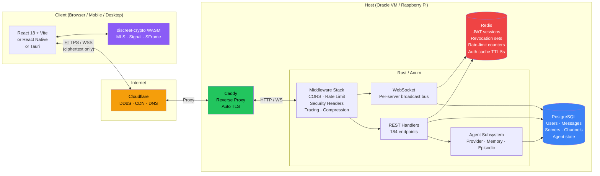

**Key principle:** The server only ever sees ciphertext. All encryption and decryption happens inside `discreet-crypto` on the client device. The server is a blind relay.

---

## 1. Authentication Flow

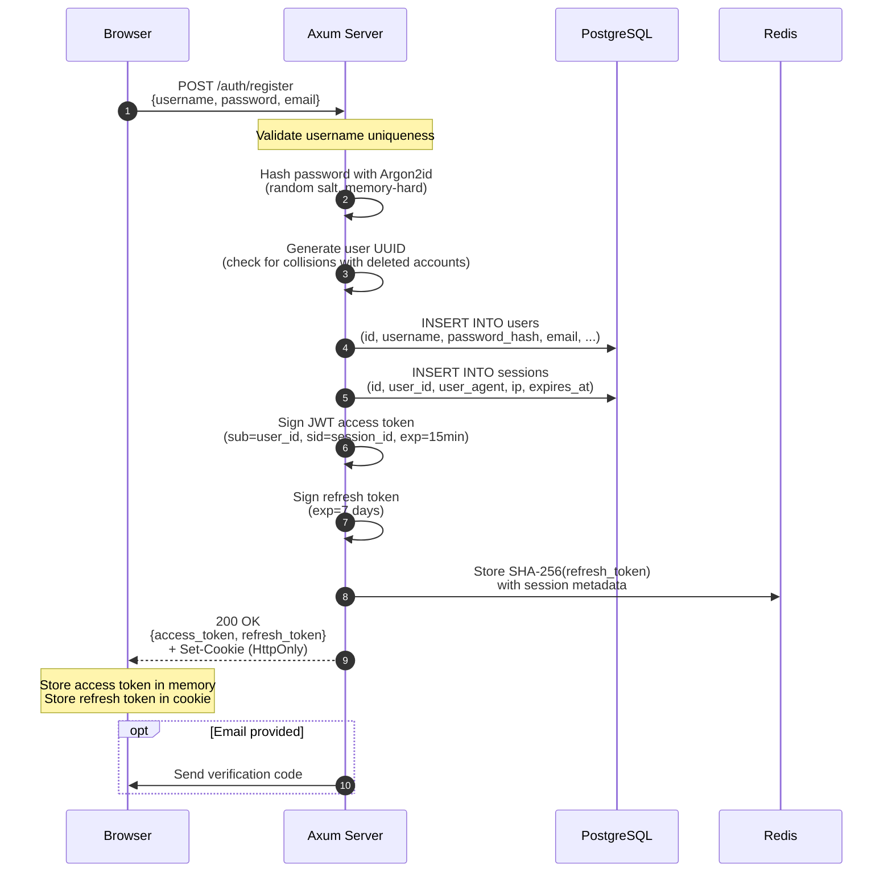

### Login with 2FA

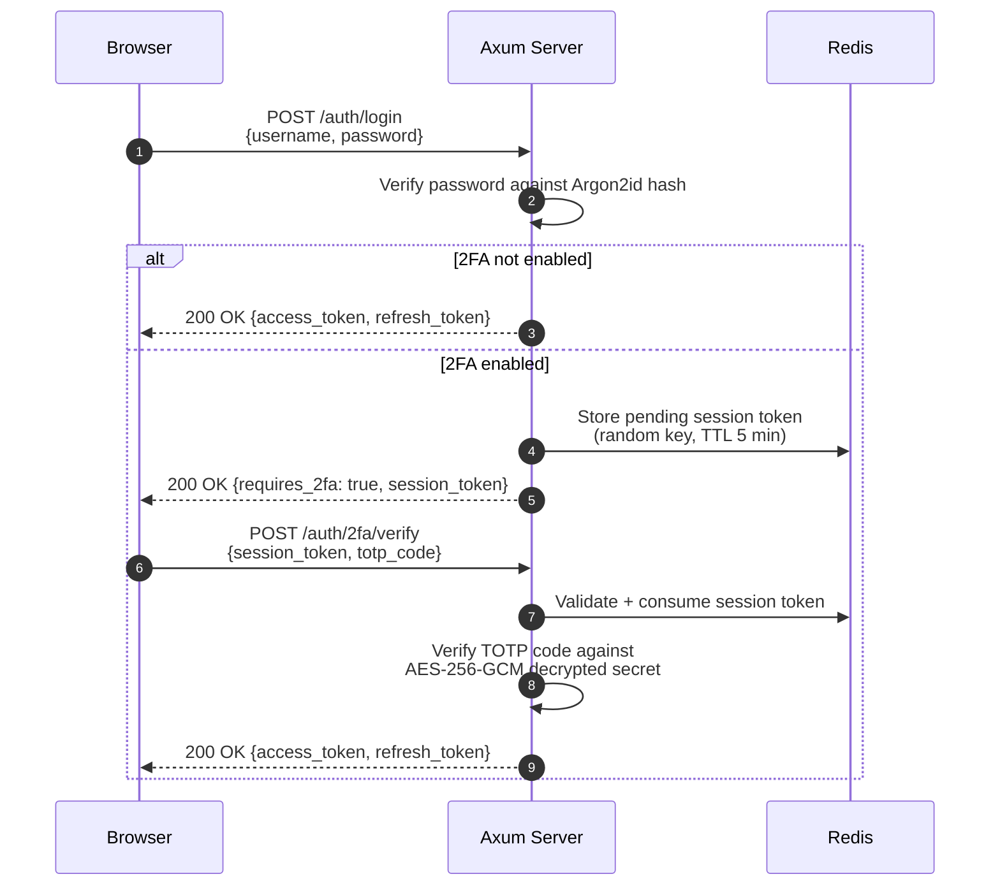

---

## 2. Message Flow

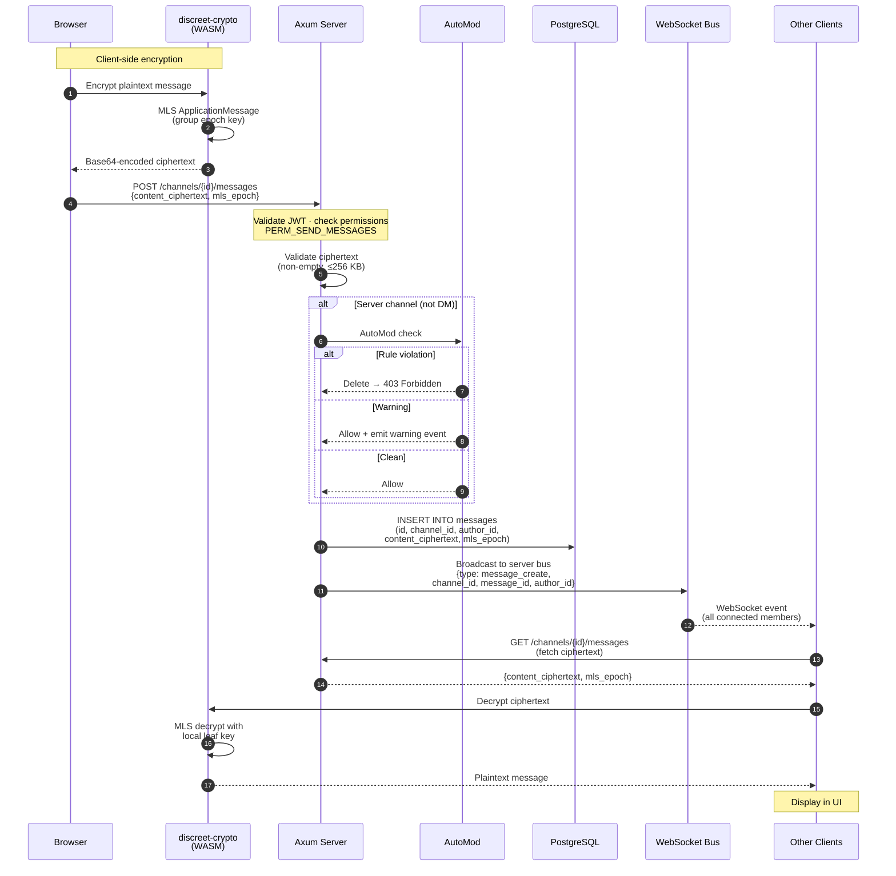

### Message broadcast detail

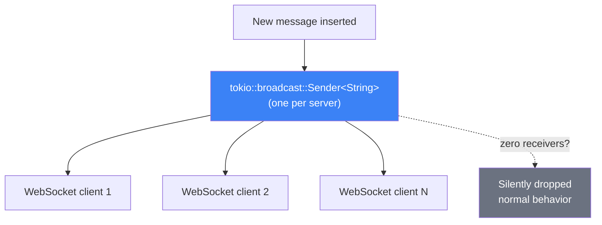

---

## 3. AI Agent Flow

```mermaid
sequenceDiagram
    autonumber
    participant U as User
    participant S as Axum Server
    participant PG as PostgreSQL
    participant MEM as Memory Module
    participant P as Provider API<br/>(Anthropic / OpenAI / Ollama)
    participant WS as WebSocket Bus

    U->>S: Message mentioning @BotName<br/>(or trigger keyword, or DM)

    S->>S: should_agent_respond()<br/>Check name / UUID / keywords / DM

    alt No match
        Note over S: Normal message flow only
    else Match found
        S->>S: Spawn async background task<br/>(non-blocking)

        rect rgb(30, 35, 50)
            Note over S,P: Background task (does not block sender)

            S->>PG: Load agent config<br/>(provider, model, system prompt)
            S->>S: Decrypt API key<br/>AES-256-GCM with derived key

            S->>MEM: Load context

            alt SlidingWindow mode (default)
                MEM->>PG: Last N messages (default 20, max 100)<br/>Cap 4,000 chars/msg, 100K total
            else Summary mode
                MEM->>PG: Last N messages + stored summary
            else None mode
                Note over MEM: No context loaded
            end

            MEM->>MEM: Anonymize users → "User 1", "User 2"
            MEM->>MEM: Label roles (user / assistant)
            MEM->>MEM: Merge consecutive same-role messages

            opt Episodic memory available
                MEM->>PG: Load encrypted facts<br/>(max 200 per agent-channel)
                MEM->>MEM: Decrypt facts with derived key<br/>Inject as system message (≤8K chars)
            end

            MEM-->>S: Formatted messages array

            S->>P: POST /v1/messages<br/>{system prompt + safety preamble,<br/>messages, model, temp=0.7,<br/>max_tokens=1024}

            P-->>S: LLM response text

            S->>S: Sanitize response<br/>• Enforce safety preamble rules<br/>• Cap at 1,024 tokens<br/>• Add AI disclosure text

            S->>PG: INSERT INTO messages<br/>(author_id=bot_user_id,<br/>mls_epoch=0)

            S->>WS: Broadcast message_create

            opt Every K messages (default 10)
                S->>P: Episodic memory extraction prompt
                P-->>S: JSON array of facts<br/>{category, content, confidence}
                S->>S: Encrypt each fact<br/>AES-256-GCM per agent-channel key
                S->>PG: Upsert agent_episodic_facts<br/>(evict oldest if >200)
            end
        end
    end
```

### Agent provider architecture

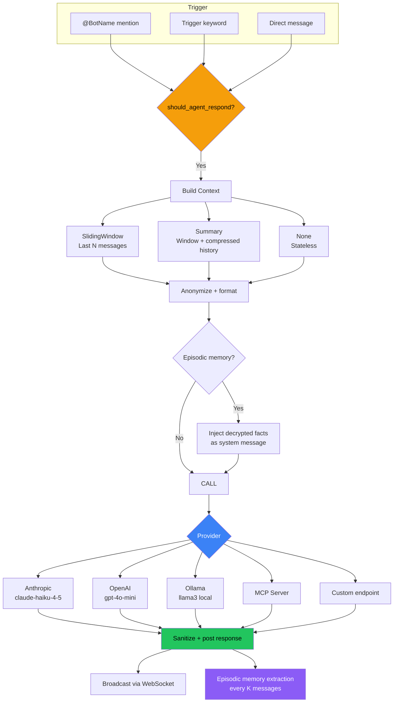

---

## 4. Session Lifecycle

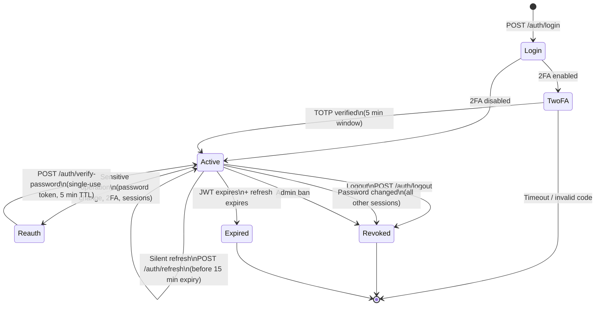

### Session validation on every request

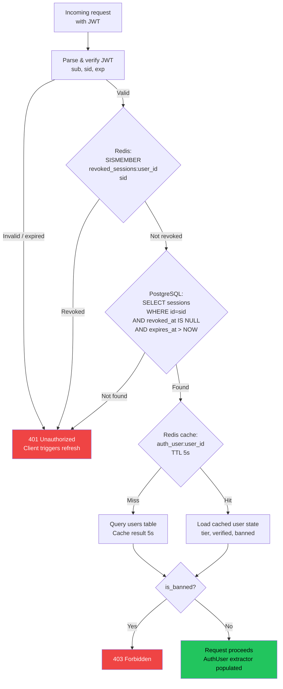

### Token timeline

```mermaid
gantt
    title Session Token Lifecycle
    dateFormat HH:mm
    axisFormat %H:%M

    section Access Token
    JWT valid (15 min)          :active, jwt1, 00:00, 15min
    Refresh → new JWT           :crit, r1, after jwt1, 1min
    JWT valid (15 min)          :active, jwt2, after r1, 15min
    Refresh → new JWT           :crit, r2, after jwt2, 1min
    JWT valid (15 min)          :active, jwt3, after r2, 15min

    section Refresh Token
    Refresh token valid (7 days) :done, ref, 00:00, 168h

    section Device Session
    Session record in DB         :done, sess, 00:00, 168h
```

---

## Encryption Layers

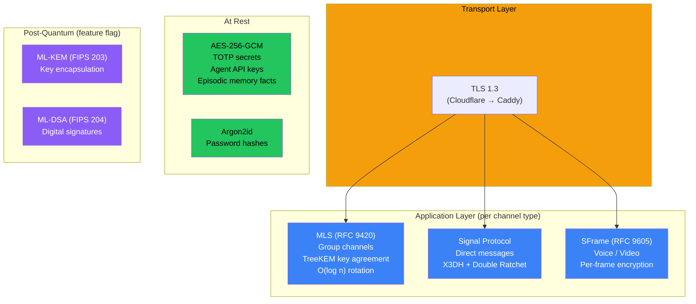

---

## Database Schema (simplified)

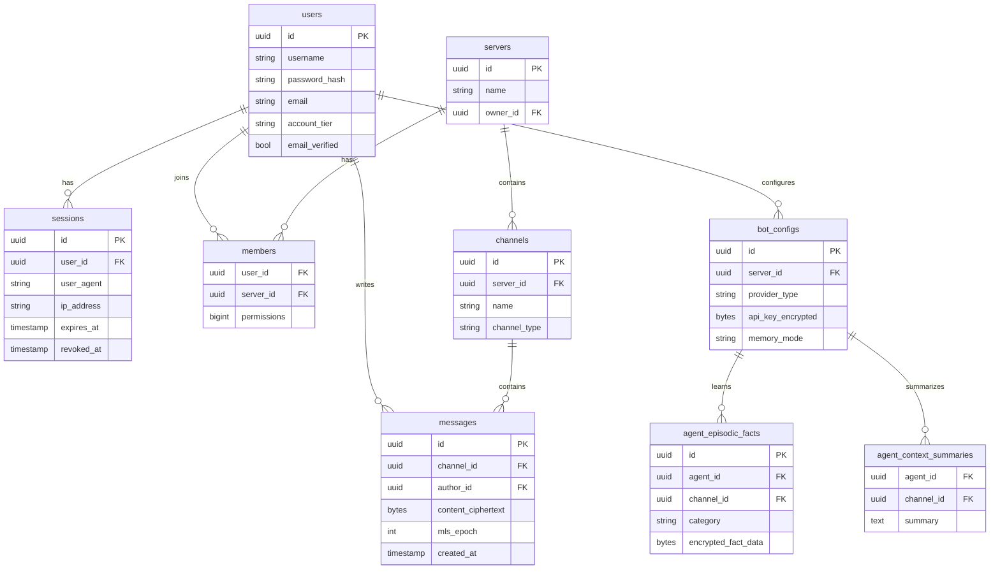
